# Deep Learning From Scratch

**From-scratch implementations of neural networks, optimization algorithms, and deep learning architectures — from mathematical foundations and manual forward/backward propagation to practical PyTorch implementations.**

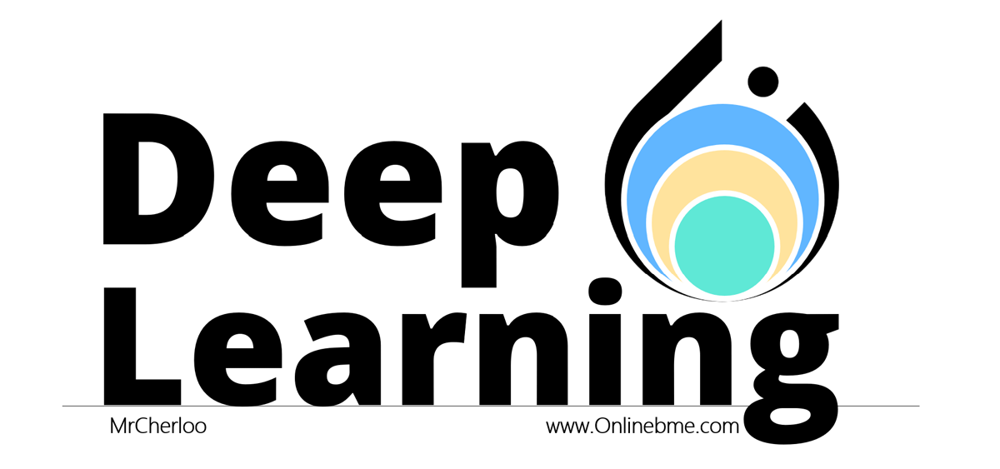

**Author:** Mohammad Norizadeh Cherloo

Machine Learning · Deep Learning · Neural Decoding · Biomedical Signal Processing · Brain-Computer Interfaces

[](https://onlinebme.com/)
[](https://scholar.google.com/citations?user=fIKpYm8AAAAJ)
[](https://www.youtube.com/@Mrcherloo)
[](https://www.linkedin.com/in/mohammad-norizadeh-cherloo/)

---

## About This Repository

This repository documents my work on **Deep Learning from first principles**, with an emphasis on understanding the mathematics and internal operations of neural networks.

The core philosophy is:

> **Understand the mathematics → derive the algorithm → implement it manually → validate it → use modern frameworks for practical models.**

Rather than relying only on high-level deep-learning libraries, the first part of this repository implements fundamental components **manually**, including forward propagation, backpropagation, cost functions, optimization algorithms, convolution, pooling, batch normalization, and recurrent-network operations.

The second part moves to **PyTorch implementations** of classical and modern neural-network architectures and applies them to practical problems in computer vision, time-series analysis, EEG signal processing, and natural language processing.

### Repository Structure

* **Part I — Deep Learning From Scratch:** Manual mathematical and algorithmic implementations
* **Part II — Deep Learning with PyTorch:** Practical neural-network architectures and applications

---

## Table of Contents

* [1. Deep Learning From Scratch](#1-deep-learning-from-scratch)

  * [Multilayer Perceptron](#multilayer-perceptron-mlp)
  * [Optimization Algorithms](#optimization-algorithms)
  * [Convolutional Neural Networks](#convolutional-neural-networks-cnns)
  * [Recurrent Neural Networks](#recurrent-neural-networks-rnns)
* [2. Deep Learning with PyTorch](#2-deep-learning-with-pytorch)

  * [MLP](#pytorch-mlp)
  * [CNN Architectures](#pytorch-cnns)
  * [RNN, LSTM and GRU](#pytorch-rnn-lstm-and-gru)
* [Practical Projects](#practical-projects)
* [From Mathematical Foundations to Practical Deep Learning](#from-mathematical-foundations-to-practical-deep-learning)
* [Attention Mechanisms & Transformers — Coming Soon](#attention-mechanisms--transformers--coming-soon)
* [Full Video Course](#full-video-course)
* [Contact](#contact)

---

# Attention Mechanisms & Transformers — Coming Soon

**Attention mechanisms and Transformer architectures will be added soon**, continuing the same progression from mathematical foundations and manual implementations to practical PyTorch models.

---

# 1. Deep Learning From Scratch

**[Open the complete manual implementation folder](https://github.com/Mohammad-Norizadeh-Cherloo/Deep-Learning-From-Scratch/tree/main/Deep%20Learning%20From%20Scratch%20%28manual%20impelementation%29)**

The manual implementation section focuses on understanding the mathematical operations behind neural networks rather than treating them as black boxes.

---

## Multilayer Perceptron (MLP)

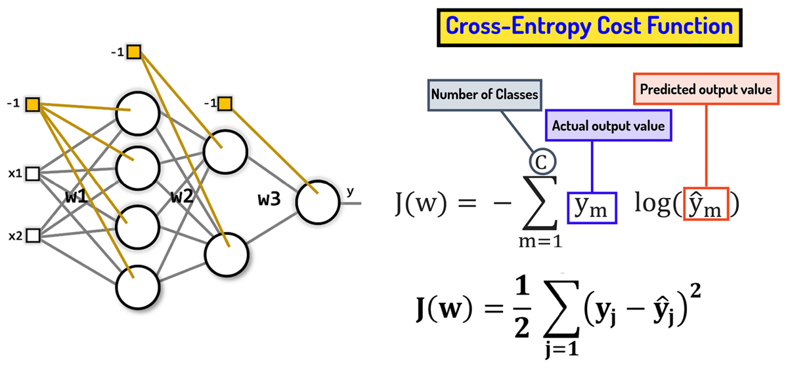

Manual implementation of multilayer perceptrons, including forward propagation, backward propagation, cost functions, and optimization.

* Forward propagation
* Backpropagation
* MSE / LMS cost function
* Cross-Entropy loss
* Gradient-based optimization

**[Open MLP implementations](https://github.com/Mohammad-Norizadeh-Cherloo/Deep-Learning-From-Scratch/tree/main/Deep%20Learning%20From%20Scratch%20%28manual%20impelementation%29/1-%20Multilayer%20Perceptron%28MLP%29)**

---

## Optimization Algorithms

Five optimization algorithms are implemented manually and compared through convergence experiments.

| Optimizer             | Visualization                                 |
| --------------------- | --------------------------------------------- |
| **SGD**               | 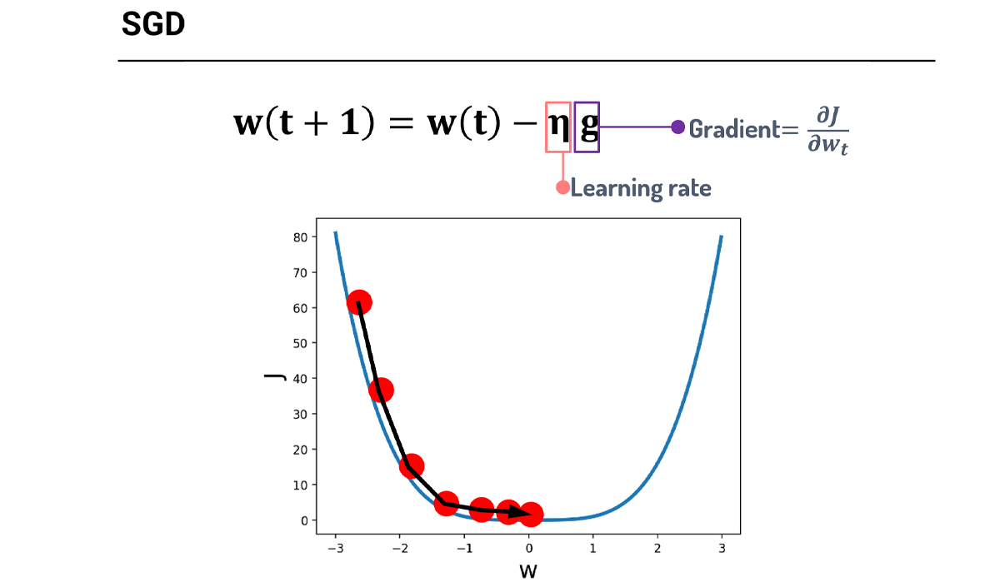                        |
| **SGD with Momentum** | 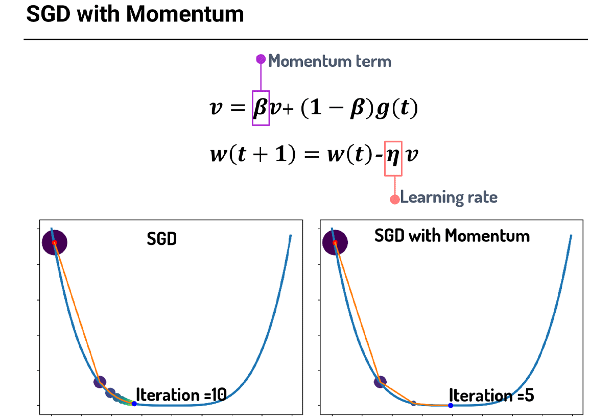 |
| **AdaGrad**           | 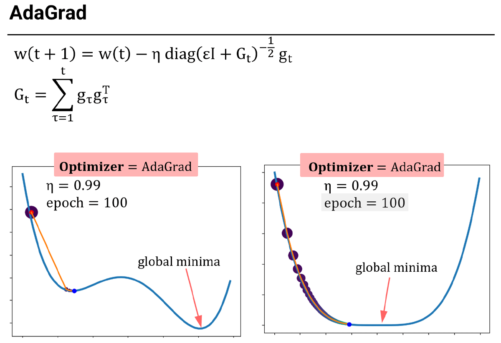                |
| **RMSprop**           | 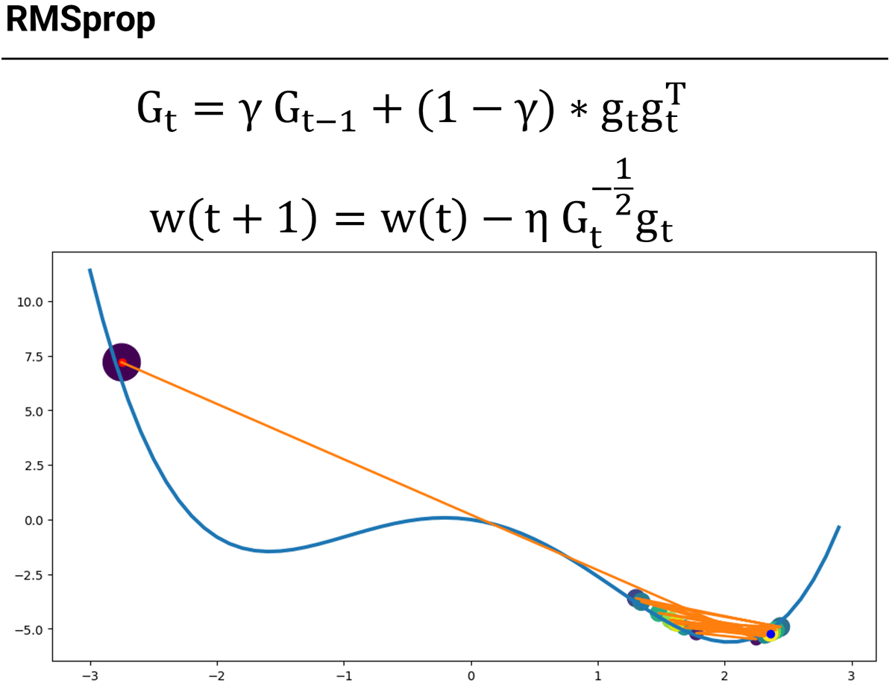                |
| **Adam**              | 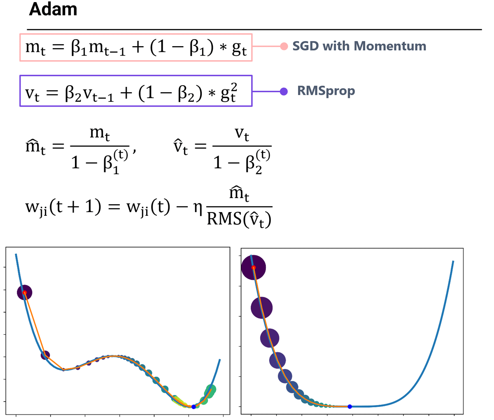                      |

**[Open optimizer implementations](https://github.com/Mohammad-Norizadeh-Cherloo/Deep-Learning-From-Scratch/tree/main/Deep%20Learning%20From%20Scratch%20%28manual%20impelementation%29/1-%20Multilayer%20Perceptron%28MLP%29/2-%20Optimizers)**

---

## Convolutional Neural Networks (CNNs)

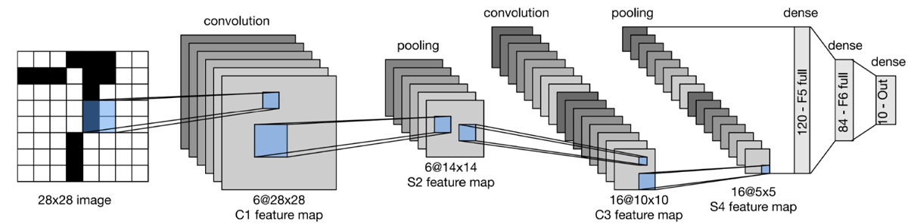

Manual implementation of the fundamental components of convolutional neural networks.

* 2D convolution
* Average pooling
* Fully connected layers
* Batch Normalization
* LeNet-5
* LeNet-5 with Batch Normalization

**[Open manual CNN implementations](https://github.com/Mohammad-Norizadeh-Cherloo/Deep-Learning-From-Scratch/tree/main/Deep%20Learning%20From%20Scratch%20%28manual%20impelementation%29/2-%20Covnvolutional%20Neural%20Netwroks%20%28CNNs%29)**

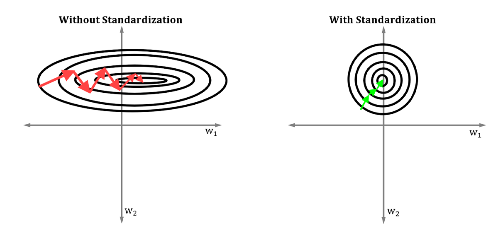

---

## Recurrent Neural Networks (RNNs)
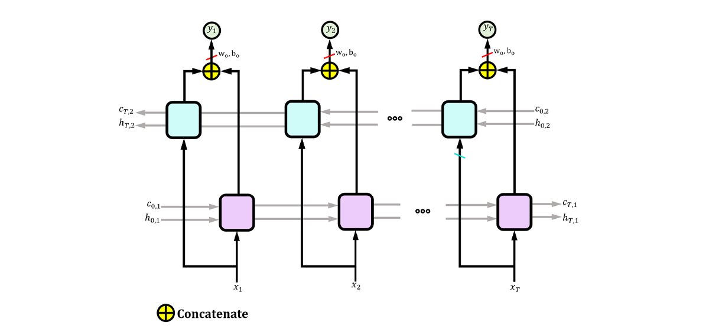
Manual implementations of recurrent neural networks, including sequence processing and Backpropagation Through Time.

* Vanilla RNN
* Bidirectional RNN
* LSTM
* Bidirectional LSTM
* Backpropagation Through Time (BPTT)

**[Open manual RNN implementations](https://github.com/Mohammad-Norizadeh-Cherloo/Deep-Learning-From-Scratch/tree/main/Deep%20Learning%20From%20Scratch%20%28manual%20impelementation%29/3-%20Recurrent%20Neural%20Networks%20%28RNNs%29)**

---

# 2. Deep Learning with PyTorch

**[Open the complete PyTorch implementation folder](https://github.com/Mohammad-Norizadeh-Cherloo/Deep-Learning-From-Scratch/tree/main/Deep%20Learning-PyTorch)**

After studying and implementing the underlying operations manually, the repository moves to practical implementations using **PyTorch**.

---

## PyTorch MLP

Implementations of multilayer perceptrons for classification and regression.

**[Open PyTorch MLP implementations](https://github.com/Mohammad-Norizadeh-Cherloo/Deep-Learning-From-Scratch/tree/main/Deep%20Learning-PyTorch/1-%20MLP)**

---

## PyTorch CNNs

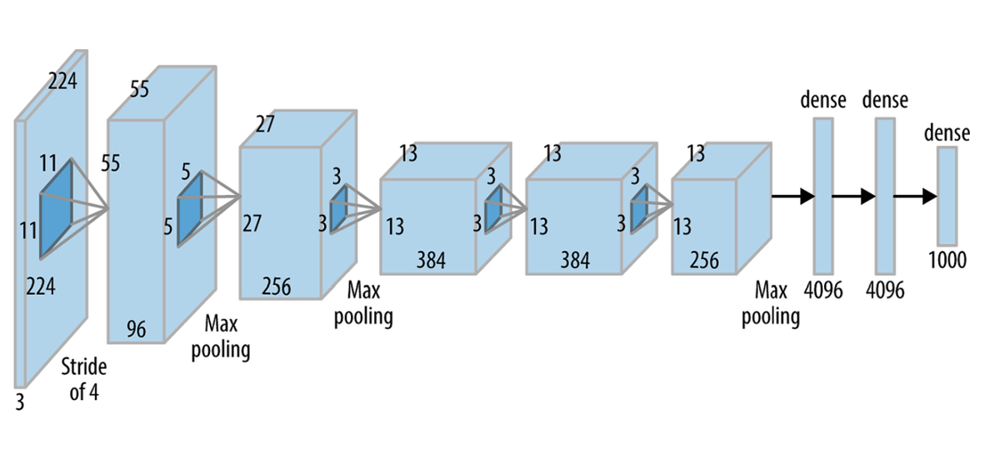

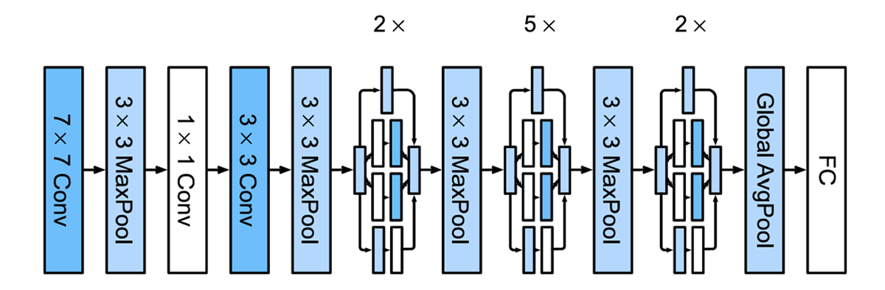

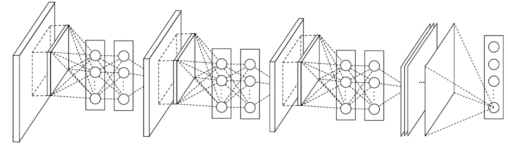

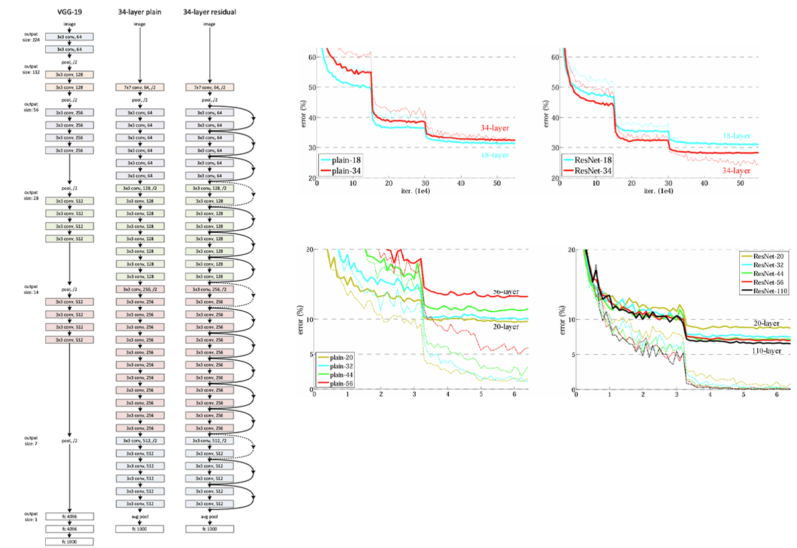

The CNN section contains implementations and experiments with influential convolutional neural-network architectures:

* **LeNet-5**
* **AlexNet**
* **VGG**
* **Network in Network (NiN)**
* **GoogLeNet**
* **Light PlainNet**
* **Light ResNet**

**[Open PyTorch CNN implementations](https://github.com/Mohammad-Norizadeh-Cherloo/Deep-Learning-From-Scratch/tree/main/Deep%20Learning-PyTorch/2-%20CNNs)**

---

## PyTorch RNN, LSTM and GRU
.png)
The recurrent-network section covers sequence models for classification, time-series prediction, EEG signal analysis, and natural language processing.

* **RNN**
* **GRU**
* **LSTM**
* **Bidirectional LSTM**

**[Open PyTorch RNN implementations](https://github.com/Mohammad-Norizadeh-Cherloo/Deep-Learning-From-Scratch/tree/main/Deep%20Learning-PyTorch/3-%20RNNs)**

---

# Practical Projects

The implementations are applied to problems across **computer vision, regression, time-series prediction, biomedical signal processing, and natural language processing**.

### Digit Classification

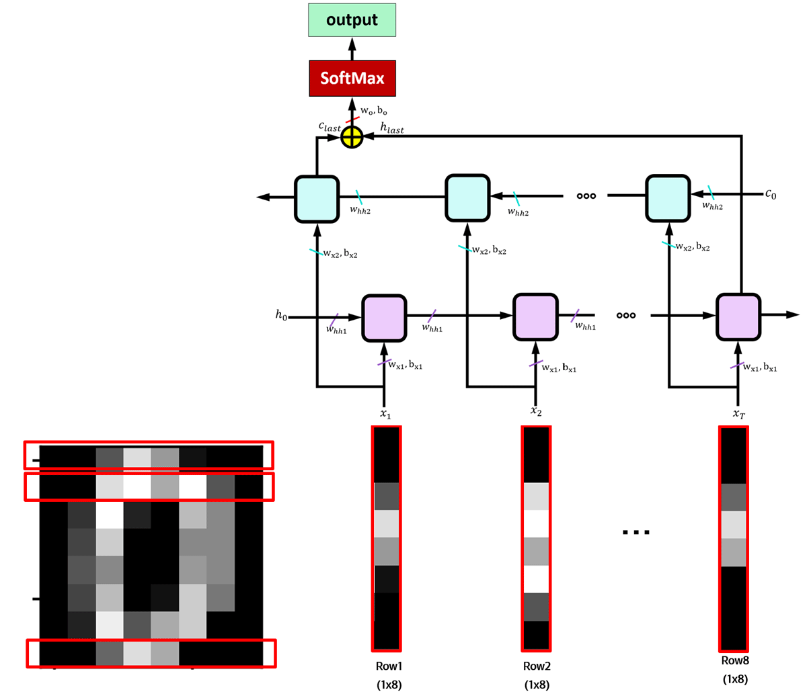

### Breast Cancer Classification

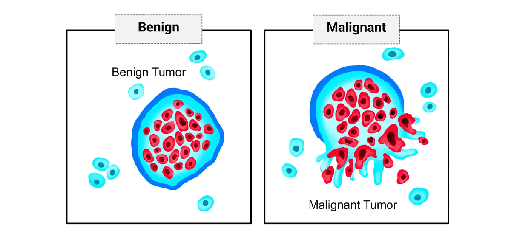

### Iris Classification

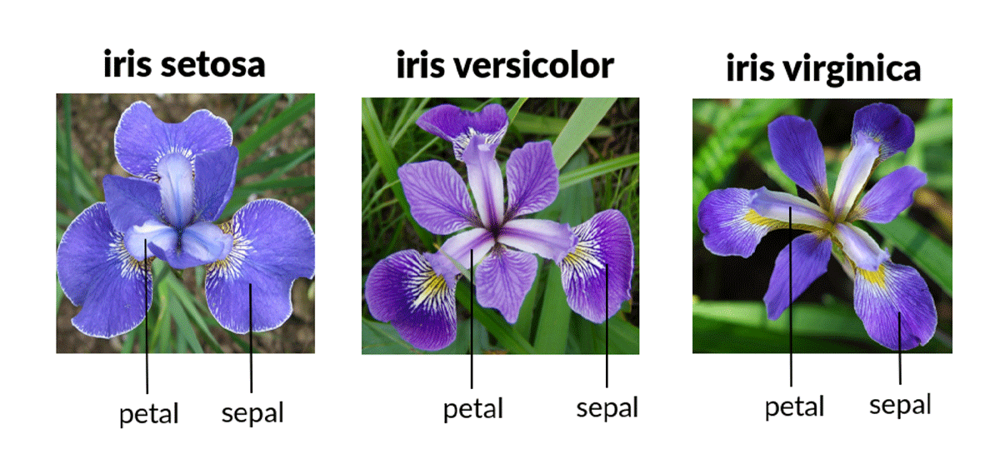

### EEG Signal Analysis

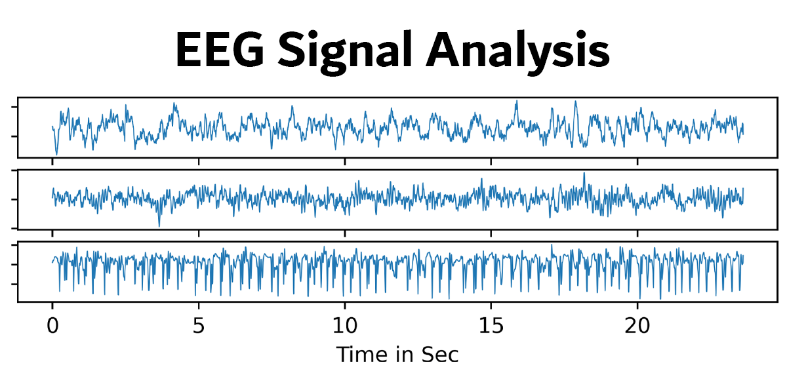

### Spam Detection

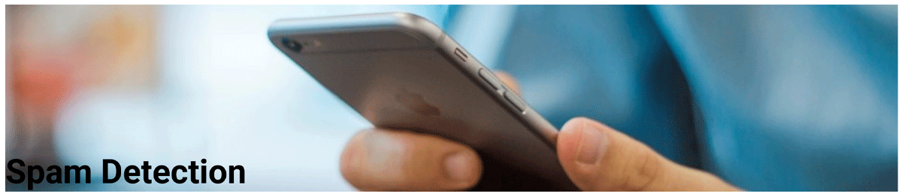

### Text Generation

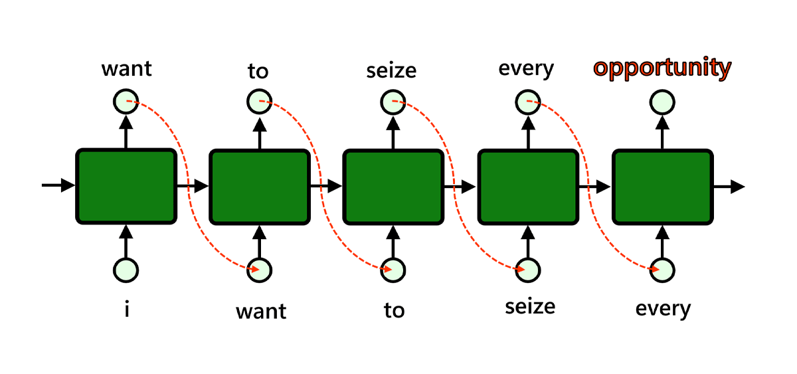

| Project                      | Model(s)                      | Application                  |
| ---------------------------- | ----------------------------- | ---------------------------- |
| House Price Prediction       | MLP                           | Regression                   |
| Breast Cancer Classification | MLP                           | Classification               |
| Iris Classification          | MLP                           | Classification               |
| Digit Classification         | MLP, RNN, LSTM, BiLSTM        | Classification               |
| Air Quality Prediction       | MLP, RNN, LSTM, GRU           | Time Series                  |
| MNIST Digit Classification   | LeNet-5, AlexNet, VGG, ResNet | Computer Vision              |
| Epilepsy Detection from EEG  | GRU                           | Biomedical Signal Processing |
| Spam Detection               | LSTM                          | NLP                          |
| Word Generation              | LSTM                          | NLP                          |

---

# From Mathematical Foundations to Practical Deep Learning

The repository follows a progression from understanding the internal mathematics of neural networks to using modern deep-learning frameworks:

```text
Mathematical Foundations
        ↓
Forward Propagation
        ↓
Backpropagation
        ↓
Cost Functions
        ↓
Optimization Algorithms
        ↓
Manual Neural-Network Implementations
        ↓
Classical CNN / RNN Architectures
        ↓
PyTorch Implementations
        ↓
Practical Applications
```

This progression is the central philosophy of the repository.

---

# Full Video Course

The mathematical foundations, neural-network concepts, and step-by-step implementations are also covered in my Deep Learning courses.

**→ [OnlineBME – Deep Learning & Neural Networks with PyTorch](https://onlinebme.com/product/implementing-neural-networks-with-pytorch/)**

---

# Contact

* **Website:** [OnlineBME](https://onlinebme.com/)
* **YouTube:** [@Mrcherloo](https://www.youtube.com/@Mrcherloo)
* **LinkedIn:** [Mohammad Norizadeh Cherloo](https://www.linkedin.com/in/mohammad-norizadeh-cherloo/)
* **Google Scholar:** [Mohammad Norizadeh Cherloo](https://scholar.google.com/citations?user=fIKpYm8AAAAJ)
* **GitHub:** [Mohammad-Norizadeh-Cherloo](https://github.com/Mohammad-Norizadeh-Cherloo)

---

> **“An old man once told me if you want to drive more easily in a city, first walk through that city on foot.”**
>
> The same is true in Artificial Intelligence. If you want to use or improve algorithms more effectively, first implement them from scratch. Only then will you gain a deeper understanding of the algorithm and the problem it solves.
>
> — Mohammad Norizadeh Cherloo
